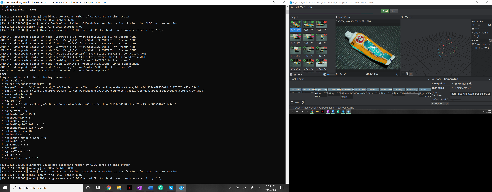
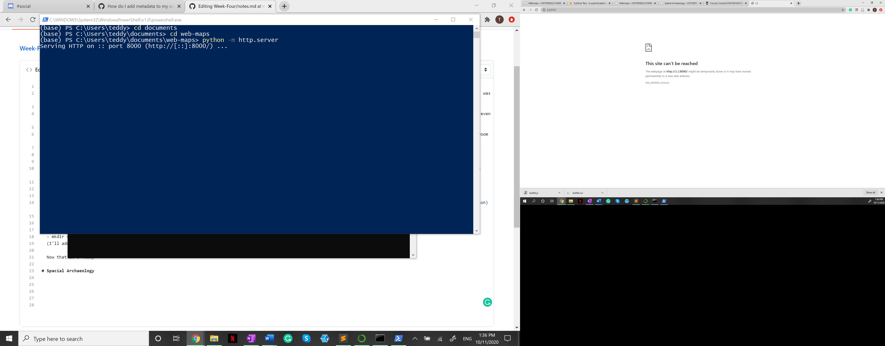
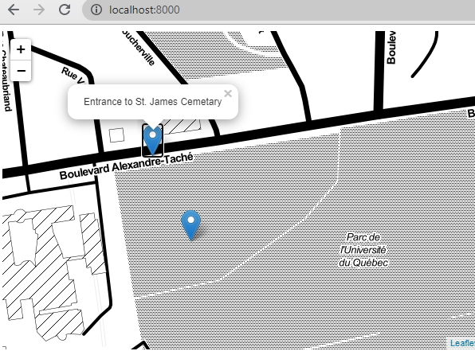
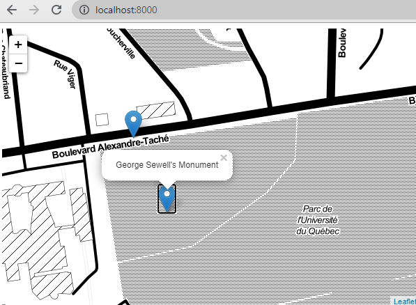

# Meshroom
  Last week I used Regard3D for my models and it didn't seem to work out for me, so for this week I will try Meshroom to compare between the two. (aka which one worked better, was easier to navigate, etc.) For this I have downloaded the Meshroom desktop version instead of using the online method since I was a bit overwhelemed by it last week. 

  My first attempt will be the Groot figurine I tried last week to have a comparison, and then I will take photos of the gravestones I record this week if it is sucessful (or even if it isn't) to try.
  
  I added my photos and clicked Start. It took some time, but the program was able to make its way to DepthMap before experiencing some issues. I will start by googling "Meshroom depthmap falure" to see what comes up. [Video](https://www.youtube.com/watch?v=loSMrBWxb1o) 
  
  I also came across this [youtube](https://www.youtube.com/watch?v=bPdBQxZ9wEA) video
  
  After some research and help from Cocochantal, it seemed that my issue (add issue screenshot here) was the type of laptop I was using instead of the images themsleves. I was unable to figure out how to fix the issue other than getting the Nvidia. For now I will set this aside, and work on it more in the following weeks. 
  
  Here are the results thus far 
  
# Webmaps

  Not overlly difficult, but I had to redownload Anaconda and Sublime to my laptop using these links for [Anaconda](https://www.anaconda.com/products/individual#download-section) and [Sublime](https://www.sublimetext.com/) (thought it would be good to have it saved here incase I need to access them again)
  
  I also had to google how to make a directory in my command prompt because I completely forgot (funny how fast you forget something when you stop using it): 
  - cd = go to 
  - mkdir = make new directory 
  (I'll add more as I go)
  
  First issue is that I can't write in $ python, instead I have to do just python. Second issue, I get http://[::]:8000/ as the link and that does not work on my computer. I have read through Discord and asked for help on the issue to see if anyone else had the same problem but solved it. 
  
  Cocochantal was so kind in helping me and suggested I use http://localhost:8000/ while the command prompt was running. And it worked!
  
  Next I added the coordinates for the St. James Cemetery (I may be off by a bit since I used Google maps to pin stuff) 
  
  
  
  I'm particularly proud of this one because I remember having a lot of trouble with it over the summer, so being able to get the map to work (thanks again to Cocochantal) and even adding new points was very exciting for me!
  
  Sidenote: for my geoJson file I had to make it just a Json file because my laptop was labelling it as geoJson.Json otherwise which just seemed to complicated. I went into the code you posted and corrected for that one issue which is on the main page of this repository.

# Spacial Archaeology
  
  
